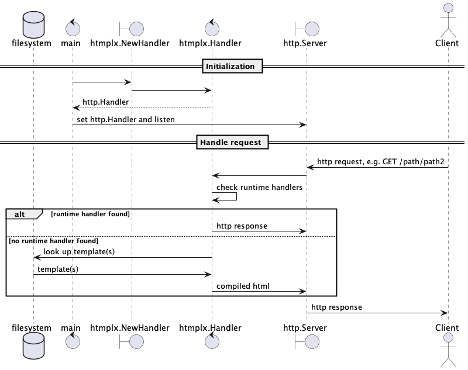
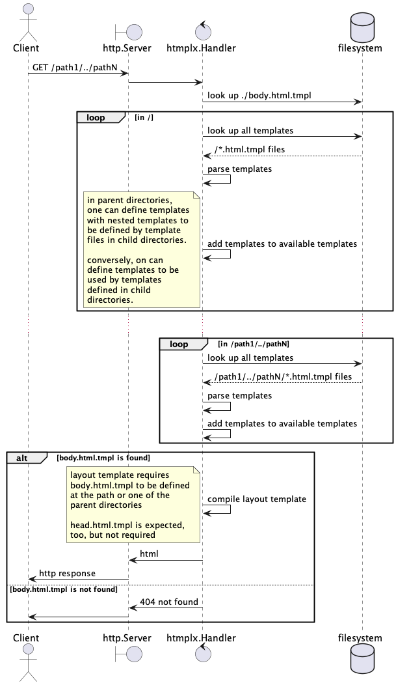

[](https://pkg.go.dev/github.com/angelbeltran/htmplx)


# Work in progress

1. [ ] Design the package
    1. [x] [docs/usage.png](./docs/usage.png)
    1. [x] [docs/template_resolution.png](./docs/template_resolution.png)


# Roadmap

1. [x] Define a general template
1. [x] Define a general template context structure
    1. [x] Consider some general values, like request path, etc.
        1. [x] Not going to define one, at least for v1.
    1. [x] Consider some general functions, etc.
        1. [x] Not going to define one, at least for v1.
1. [x] Define a package api style (builder?, factory?, server?)
    1. [x] constructors and plugins.
1. [ ] Allow dev to serve
    1. [ ] static files
        1. [x] simple filenames
        1. [x] path patterns
        1. [x] path mapping to a directory with a '404' file results in a 404 response.
    1. [x] ~~runtime generated html~~
    1. [x] non-html template assets
1. [ ] Allow devs to escape the htmplx framework
    1. [x] ~~Check for runtime handlers before return 404.~~
    1. [ ] ...


# Usage

Simple.
Given a directory, or `fs.FS`, htmplx provides an `http.Handler`.
That http.Handler, when used with any `http.Server`, simply serves `*.html.tmpl` files from that directory or any subdirectories.
Those files should be [html go templates](https://pkg.go.dev/html/template).

## Requirements

Each directory corresponding to a valid url must have a body.html.tmpl file or must have one defined
in a parent directory.

All incoming http requests will be matched against a directory by http pattern.
The directory must contain a head.html.tmpl and body.html.tmpl, with some exceptions.
Each html template, head.html.tmpl and body.html.tmpl, will be resolved with an _application context_,
and their resulting context appended to the <head> and <body> tags, respectively.

## Layout Templates

An exception to each directory served must contain a head.html.tmpl and body.html.tmpl is if a
parent directory contains one of these files, in which case the parent directory's template will be
used if the respective template is not defined in the directory.
This behavior is intended to allow for content or structure to be shared between pages.


## Parent Content Templates


#### Minimized Templates

Using shared layout templates, unlocks a powerful feature, minimized templates.
Minimized templates are merely templates not names head.html.tmpl or body.html.tmpl and declared in
a shared layout template in a parent directory.
Here's an example.

```
/static/dogs/head.html.tmpl
/static/dogs/body.html.tmpl
/static/dogs/terrier/title.html.tmpl
/static/dogs/terrier/content.html.tmpl
/static/dogs/doodle/title.html.tmpl
/static/dogs/doodle/content.html.tmpl
```

`/static/dogs/head.html.tmpl`
```html.tmpl
{{define "title"}}{{Dogs}}{{end-}}
<title>{{template "title"}}</title>
```

`/static/dogs/body.html.tmpl`
```html.tmpl
{{define "header"}}{{}}{{end-}}
{{define "content"}}{{This page is about a kind of dog}}{{end-}}
{{define "footer"}}{{}}{{end-}}
{{template "header"}}
{{template "content"}}
{{template "footer"}}
```

`/static/dogs/terrier/title.html.tmpl`
```html.tmpl
Terriers
```

`/static/dogs/terrier/header.html.tmpl`
```html.tmpl
JUST A HEADER
```

`/static/dogs/terrier/content.html.tmpl`
```html.tmpl
<em>Terriers are great!</em>
```

`/static/dogs/terrier/footer.html.tmpl`
```html.tmpl
JUST A FOOTER
```

`/static/dogs/doodle/title.html.tmpl`
```html.tmpl
Doodles
```

`/static/dogs/doodle/header.html.tmpl`
```html.tmpl
JUST A HEADER
```

`/static/dogs/doodle/content.html.tmpl`
```html.tmpl
<em>Doodles are great!</em>
```

`/static/dogs/doodle/footer.html.tmpl`
```html.tmpl
JUST A FOOTER
```

With this a request to `GET /docs/doodle` should result in the html

```html
<DOCTYPE html>
<head>
<title>Doodle</title>
</head>
<body>
JUST A HEADER
<em>Doodles are great!</em>
JUST A FOOTER
</body>
```


## API Design


The dev should get a http.Handler out of htmplx.
The dev should be able to any combination of static file serving and generated html per route.

```
application -...-> htmplx
application <-http.Handler- htmplx
```

## Generated HTML

Each request should result in a single html generating function call.

```
type HttpPattern string
type HTML string
type HTMLBuilder func(http.ResponseWriter, *http.Request) (HTML, error)

application -map[HttpPattern]HTMLBuilder-> htmplx
application <-http.Handler- htmplx
```

TODO: what to do about requests that should not result in html?


## Static HTML

Each request should result in a file look up.

```
application -dir-> htmplx
application <-http.Handler (file server)- htmplx
```


# Design

## General Usage


## Template Resolution

